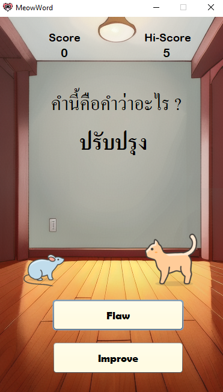

# Meow Word

Meow Word is a fun and educational English vocabulary game. Players take on the role of a mouse, tasked with selecting the correct translations of given English words. The game is a race against time, as a cat closes in on the player!  

- **Correct answers**: The cat moves backward.
- **Incorrect answers or no answer**: The cat moves closer.
- The game ends when the cat catches the mouse.

## Features

- Interactive vocabulary-building gameplay.
- Designed for English learners of all levels.
- Cute and engaging visuals with a mouse vs. cat theme.

## Built With

- **Java SDK 19**
- **SQLite** for storing word data and translations.

---

## Installation Guide

Follow these steps to set up and run the Meow Word project on your local machine:

### Prerequisites

1. Ensure you have **Java SDK 19** installed on your system. You can download it from [Oracle's Java Downloads](https://www.oracle.com/java/technologies/javase-downloads.html).
2. Install **SQLite** for managing the game's database. Download from [SQLite Downloads](https://www.sqlite.org/download.html).

### Steps to Install

1. **Clone the repository**:
    ```bash
    git clone https://github.com/NutNaphop/MeowWord.git
    cd meow-word
    ```
2. **If you use Netbean you can open with ant and build it Directly**:

3. **If not unfortunately I can find a way to install it now but you can download Directly in release**
    - [Download Game](https://github.com/NutNaphop/MeowWord/releases/tag/full)
    - Extract a file
    - Open "Meow Word.jar"
---

## Usage

1. Launch the game.
2. Answer the vocabulary questions by selecting the correct translation.
3. Avoid getting caught by the cat!

---

## Screenshots

---
